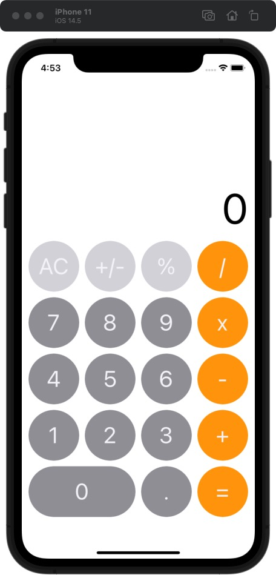
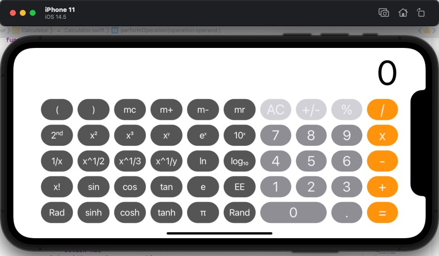
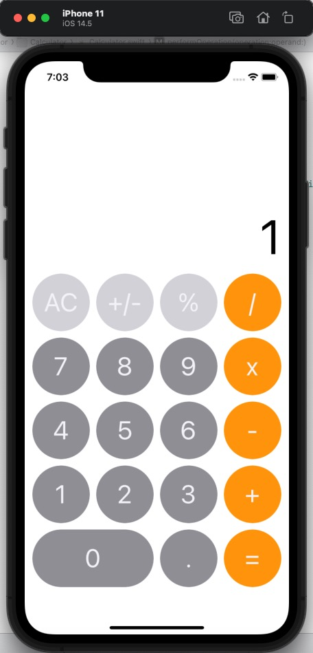
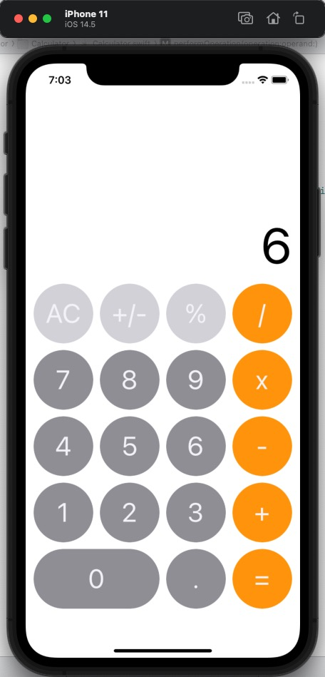
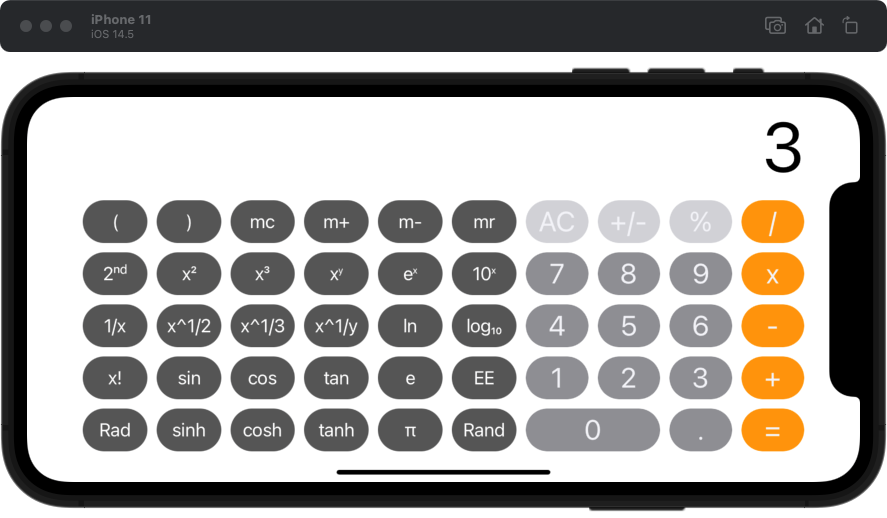
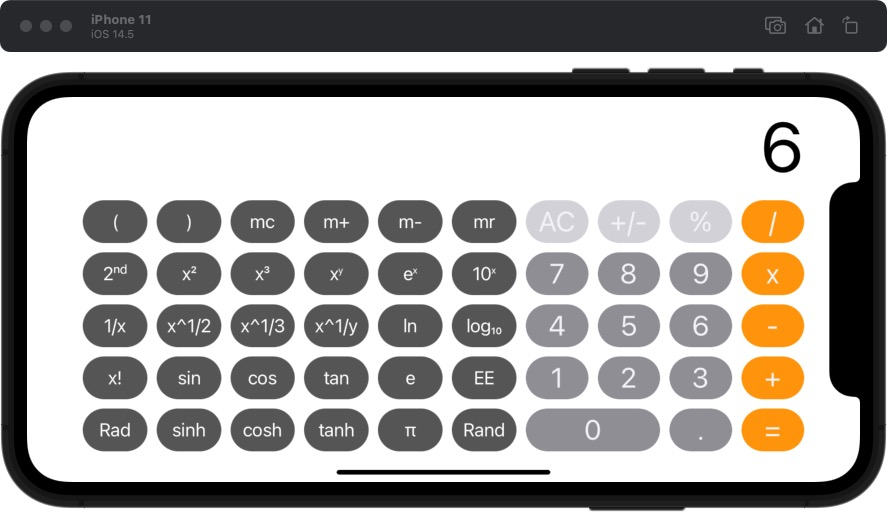
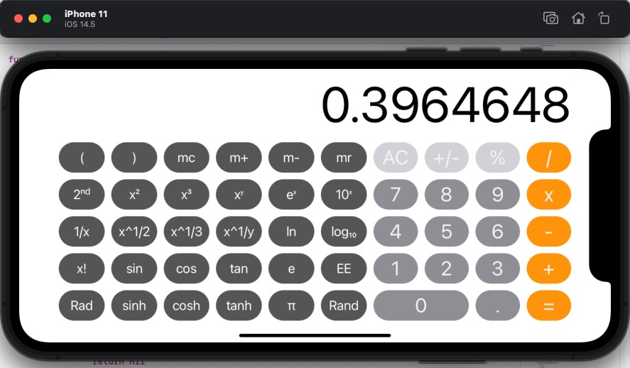
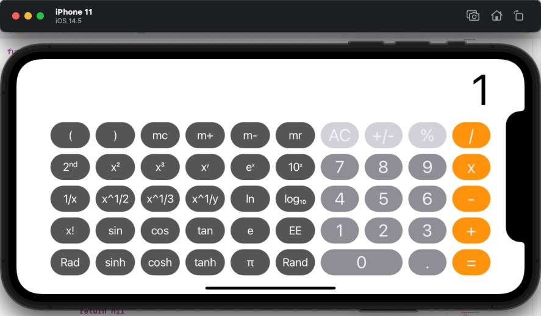
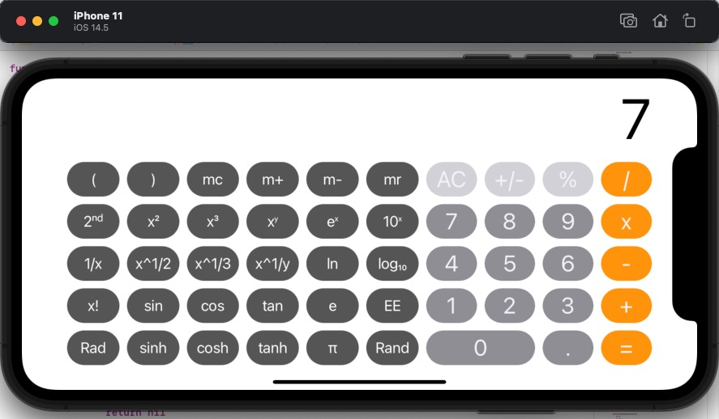

# i01 计算器

## 要求

1. 参照视频，利用**MVC**模式实现一个`Calculator`类；
2. 实现计算器基本功能，包括横屏竖屏两种状态；
3. 界面风格不限


## 实现（运行截图）

演示视频请见 https://www.bilibili.com/video/BV1mQ4y1B7Tp?share_source=copy_web

1. 基本界面

+ 竖屏：



+ 横屏：



2. 四则运算

+ 加法运算，例如依次点击”1“，"+"，"2"，"="：


+ 减法运算，例如依次点击”3“，”-“，”2“，”=“：



+ 乘法运算，例如依次点击”2“，”x“，”3“，”=“：



+ 除法运算，例如依次点击”6“，”/”，“3”，“=”：


+ 清零，点击“AC”：


3. 科学计算

由于科学计算功能较多，此处不便一一列举。

+ 三角函数运算，例如点击“9“，”0”，“sin”：

=1.png)

+ 对数运算，例如点击“e”，“ln”：

=1.png)

+ 指数运算，例如点击”2“，”x³"：


+ 开方运算，例如点击“9”，“x^1/y”，“2”，“=”：



+ 阶乘运算，例如点击“3”，“x!”：



+ 随机数生成，例如点击“Rand”：



+ 度数与弧度转换，例如点击”Rad“，则由度数转换为弧度：


可以看到，左上角显示当前为**Rad**模式，即弧度模式；此时点击”π“，”/“，”2“，“=”，”sin“：

=1.png)

再次点击“Deg”则可切换为**Deg**模式，左上角默认不显示：



+ 缓存计算：

首先点击“mr”，显示此时缓存值为**0**：


然后点击“7”，“mr+”，“AC”，“mr”，显示此时缓存值为**7**：



接着点击“4”，“m-”，“AC”，“mr”，显示此时缓存值为**3**：


最后点击“mc”，“mr”，显示此时缓存值重新归零：


+ **2ⁿᵈ**键，将某些按钮切换为交错函数：


如图可见，相关按钮已经切换，由于函数功能类似，在此不过多展示；

+ 括号功能（由于只需支持单步运算，因此仿照**macOS**中的计算器功能，作出如下实现）：

  + 当左右括号匹配时，输入右括号后立刻输出结果，例如点击”(“，”2“，”+“，”3“，”)“：

  =5.png)

  + 当左括号缺失时，输入右括号不作任何处理，例如点击”2“，”+“，”3“，”)“：

  

## 补充说明

1. 虽然找了很久的资料，但是始终没找到如何实现用**LaTeX**语法在**UIButton**中输入文本，同时又不是很想插入图片，最终导致**UIButton**中的数学公式采用了最简易的表示方法，这一点比较遗憾，很好奇其他同学是怎么实现的；

2. 在最初版本中，直接用**Double**进行运算会存在精度问题，例如`0.2x3=0.6000000000000001`，于是我对结果采用了如下处理方式

   ```swift
   let floatResult = Float((tempResult * 10000000).rounded()) / 10000000
   ```

   整体思路就是根据**Float**的精度，先将结果乘以10,000,000，就近取整后再把**Double**转化成**Float**，然后除以10,000,000作为最终结果。

   这样做的好处是显而易见的，大部分测试时发现的精度问题都得已解决，同时将结果的表示控制在8位数，可以避免**Label**显示超出界面；但是仍然存在少部分情况下，结果与精确值有偏差。

   因此，采用本方法得到的结果有效位数为7位，从8位开始不能保证有效性（虽然大部分情况下是准确的）。


## 收获

+ 通过本次作业，逐渐理解了**MVC**模式，对**iOS**开发方式有所入门；
+ 提高了查阅文档、搜索资料的能力；
+ 在解决问题的过程中，对浮点数的表示、精度问题有了更加深入的理解。

